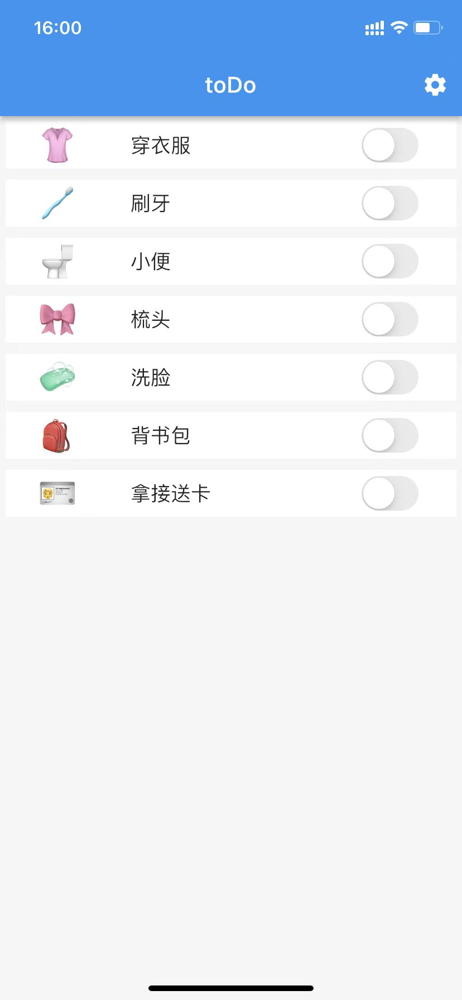
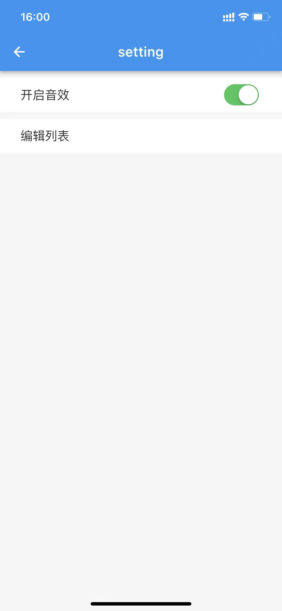

# todo

An App for todo task.  
采用flutter编写，可以编译到各个平台上使用。  
当前的版本是小朋友从起床到上学的task，帮助小朋友养成独立自主的好习惯。

version 0.1
首页显示待完成任务，点击完成播放相应的提示音。

version 0.2
增加设置功能，可以控制完成任务后是否播放声音。

version 0.3 todo 
可以新增、修改、删除任务

